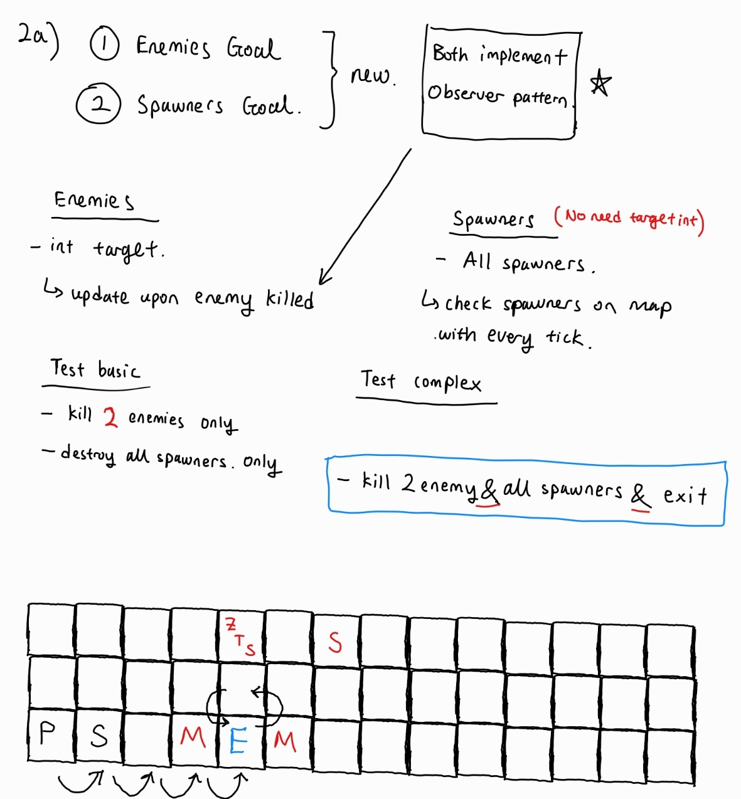
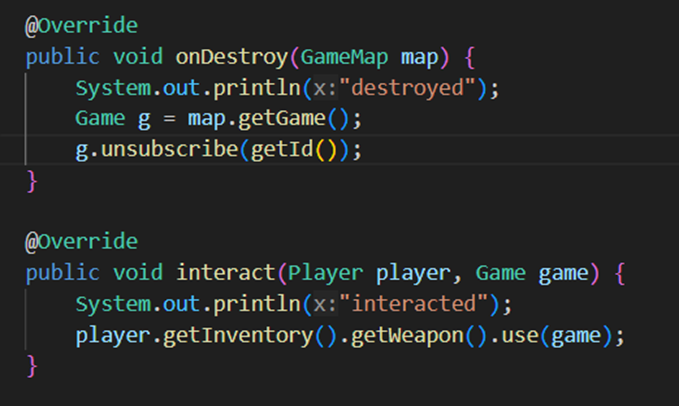
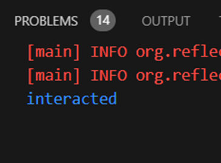
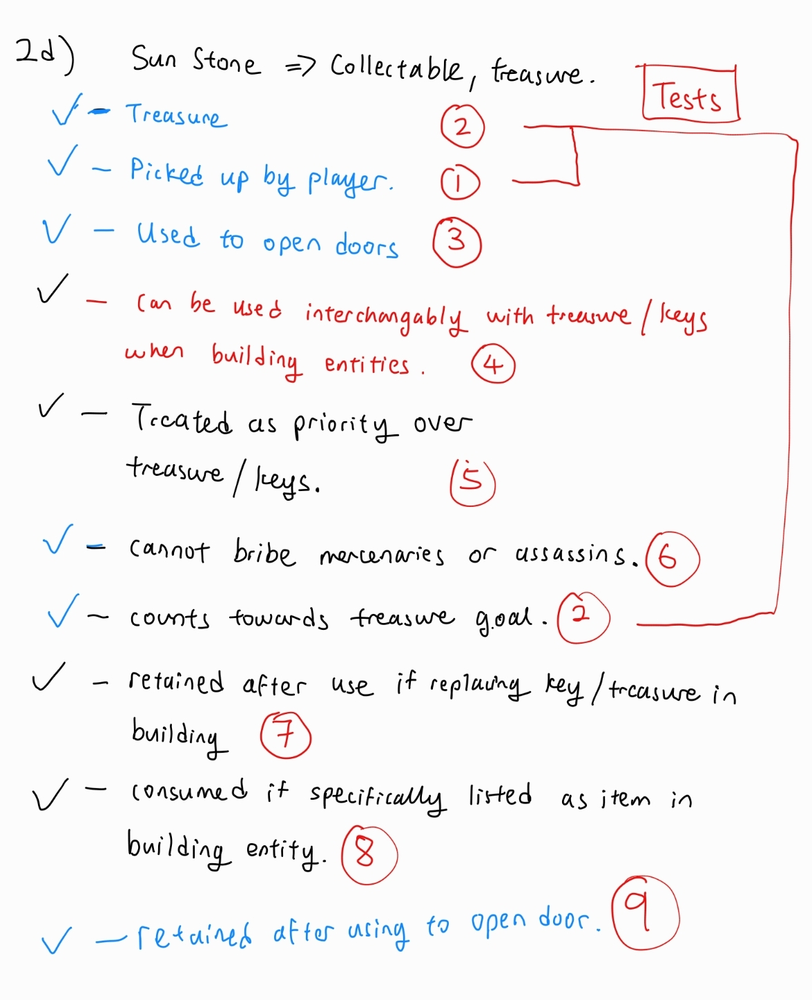

## Week 6
-	Group meeting on 18th Oct 2023
-	Went through the specs for part 1 together.
-	Answered questions 1ai, ci, ei together

## Week 7

Contributed to answering to questions 1b, d & e, f and 2a

1b) Observer Pattern 
Identify one place where the Observer Pattern is present in the codebase, and outline how the implementation relates to the key characteristics of the Observer Pattern. 
OnOverlap method implementations are observer patterns. Specifically in the example of the onOverlap implemented for Player.java, the player is the subject while the Game is the observer. When an overlap is detected between the player and an enemy entity, it triggers the game to initiate a battle sequence between the player and the enemy. 

1d) More Code Smells  
(There was an error whereby code was accidentally pushed to master instead of my branch. Tutor was informed of this incident, and help was requested to lock the master branch from direct commits. https://edstem.org/au/courses/13852/discussion/1657936?comment=3704204 )

i. What design smell is present in the above description? 
Ans: There is the presence of a lot of repeated code, perhaps due to a lack of abstraction.  

ii. Refactor the code to resolve the smell and underlying problem causing it. 
Created a superclass called collectable which extends entity and implements the following 4 methods: onOverlap, onMovedAway, onDestroy, canMoveOnto.  
There was a breach of the single responsibility principle due to an issue with the encapsulation of the entities that implemented the inventoryItem interface. There was a lack of abstraction (a superclass) for these items which resulted in a lot of repeated code for the 4 methods mentioned above. Since majority of the classes in the folder collectables had identical code logic, I could get these items to inherit the Collectable superclass and overoverwrite any methods in the sub-classes that implemented a different logic (Bomb.java onOverlap). 

1e) Open-Closed Goals 
https://nw-syd-gitlab.cseunsw.tech/COMP2511/23T3/teams/M13B_JIGGLYPUFF/assignment-ii/-/merge_requests/3  

i. Do you think the design is of good quality here? Do you think it complies with the open-closed principle? Do you think the design should be changed? 
No the design is not good. It breaches open and closed principle since if there is a new goal case to be added, both the Goal.java and GoalFactory.java need to be modified to implement the new change. Since many places will require edits, it breaches the single responsibility principle as well. Thus, to improve the code, a strategy method can be used on the Goal type instead. 

ii. If you think the design is sufficient as it is, justify your decision. If you think the answer is no, pick a suitable Design Pattern that would improve the quality of the code and refactor the code accordingly. 
Currently, a composite pattern has already been set-up, but introducing a strategy pattern on top of that further optimises the code. I implemented a new interface called GoalType and changed the attribute (String type) in Goal.java to (GoalType type). Moreover, for each different goal condition (eg. Treasure, boulder, And etc), I created a new class to implement GoalType and have two functions achieve & toString. Hence, in Goal.java, for achieve and tostring methods, I can just call the GoalType interface methods toString and Achieve which executes their logic according to which GoalType was selected. Moreover, I also changed the GoalFactory.java such that when new goals are created, the Type parameter is now of type GoalType instead of String. This updated version now satisfies the open and closed principle and single responsibility principle since an extension of a new goal criteria just requires a new class to be created, implementing GoalType and an extra case in GoalFactory.java.

1f) Open refactoring
https://nw-syd-gitlab.cseunsw.tech/COMP2511/23T3/teams/M13B_JIGGLYPUFF/assignment-ii/-/merge_requests/4 

Added BuildableType interface to implement the method use, and added an attribute type (BuildableType) to Buildable class. Buildable can consist of several types including consumable and indestructible. Consumable type buildables lose 1 durability when used while indestructible type buildables do not lose any durability. Though no buildables in the game now implement the indestructible type, this file potentially allows for code extension in the future. The constructor method of Buildables is adjusted such that when a parameter of integer durability is added, the buildable object is automatically created as a consumable BuildableType. Moreover, the use method was adjusted slightly in the BattleItem interface to be a Boolean instead of void. Reason for doing so can be found in task 3 for the proper implementation of destroying a zombie spawner.

2a) Open refactoring
https://nw-syd-gitlab.cseunsw.tech/COMP2511/23T3/teams/M13B_JIGGLYPUFF/assignment-ii/-/merge_requests/5 

Completed microevolution task2a. Using a strategy pattern in part 1e made the code extension much easier. New files were created to account for the enemy goal and destroy all spawner goal of which both implemented the GoalType interface. enemy goal was similar to the treasure goal and I used a similar implementation to treasures, with an attribute enemyKillCount for player to keep track of the number of enemies killed. Spawner on the other hand did not require a target as I just needed to check if the map had anymore existing zombie toast spawners before accomplishing the goal. However, this proved to be challenging since I discovered that the code base had implemented some logic incorrectly. See Task 3 for ore details. In summary, onDestroy was not properly implemented for the zombie toast spawner, meaning that the original destroy method did not remove the spawner from the map. Once this was rectified, my created tests started passing. This was a valuable experience as it made me adaptable to foreign software and learn how each code interacts with each other. Moreover, it taught me not to assume implementation  to be intuitive. eg. going up command actually results in a decrease in y-axis and going down results in the increase in y-axis. I encountered this issue when running tests on the grid.

Design:
Extension of part 1e. Implemented a strategy pattern based on the interface GoalType. Each time a new goal is introduced, a new file is created for the Goal class, eg. GoalEnemy.java which extends the superclass Goal.java which implements the interface GoalType.java. Hence, this adheres to the open and close principle. 

@Test
Since other goal tests already tested for conjunction/disjunction, not many new tests needed to be written to test this behaviour
@Tag("13-5") basic goals (complete enemy goal) 
@Tag("13-6") basic goals (complete enemy goal by destroying spawner) 
@Tag("14-7") complex goals (complete enemy & exit goal) 
@Tag("14-8") complex goals (complete enemy or exit goal) 

Task 3
As I was implementing part 2a, I realized that there was an error with the implementation of the code to destroy a Zombie toast spawner. Though the interaction between a player holding a weapon and the spawner was successfully, the onDestroy method of was never accessed. Moreover, the onDestroy method did not remove the zombie toast spawner from the board. To solve this issue, the interact method was edited such that upon successful use of weapon again the spawner, the onDestroy method is called and the spawner is removed from the map using the map.removeNode() method. Moreover, I fixed the Zombie spawner tests which was expecting the value 1 even when all spawners had been destroyed.

Team met on Friday 3pm (week 7)
Tasks completed
Ezekiel - 1b, 1d, 1e, 1f (a third), 2a
Amy - Partial 1c
Cade - NIL
Agreed to complete all of part 1 and write all tests for part 2 by week 8 Thursday

## Week 8

1f) Open refactoring
https://nw-syd-gitlab.cseunsw.tech/COMP2511/23T3/teams/M13B_JIGGLYPUFF/assignment-ii/-/merge_requests/7

Made a change to Inventory.checkbuildCriteria(). Initially took in a boolean to determine if buildable is a shield. However, this was a restricted way to check especially with the introduction of new buildable entities. Hence, this argument was changed to take in a string before there are checks for the String to match “bow”, “shield” etc before it is compared to the respective build criteria. This accommodates for more buildable entities. Moreover, I removed the remove boolean as it was not necessary. The materials checking in checkbuildCriteria() was also removed as this was already done prior when determining the list of valid buildable entities in Game.build() 

https://nw-syd-gitlab.cseunsw.tech/COMP2511/23T3/teams/M13B_JIGGLYPUFF/assignment-ii/-/merge_requests/7

Changed inventory hasWeapons() and getWeapons() to be less restrictive and accomodate for all battle items rather than being limited to just a bow and sword.

2d) Sunstone and other buildable entities 
https://nw-syd-gitlab.cseunsw.tech/COMP2511/23T3/teams/M13B_JIGGLYPUFF/assignment-ii/-/merge_requests/7

Completed task 2d. Sunstone was created to extend collectable which implements inventory item. Sceptre and midnight armour was created under buildables, both to implement the indestructible buildable type with no durability. The challenge came when implementing the behaviour of the buildable entities. First problem was when creating the behaviour for sceptre, I discovered an error in implementation of the bribe behaviour of a mercenary. Hence, I had to fix it before proceeding on with sceptre implementation. Consequently it was not possible to separate this change into a different merge request as suggested by the specs. Moreover, I was also a little confused with the movement of an allied mercenary, hence, I spent quite a fair bit of time working on the tests. 

assumptions:
- Sceptre is indestructible. Has no durability
- The behaviour of possessing multiple sceptres is as such. The first sceptre attained using the getFirst() method is used.
- When trying to open a door with both a key and a sunstone in the player's inventory, the sunstone is used
- The behaviour when mind_control_duration is as such. The mecenary becomes an enemy again.
- The User can keep using the sceptre repeatedly, causing the mind control duration to reset.
- Midnight armour counts as a weapon when destroying zombie toast spawners.

Design:
Strategy pattern. Build upon from task 1f. 2 buildable types. Either indestructible (no loss of durability when weapon is used) or  or consumable (loss of durability when the weapon is used). When buildable entities are created, a new file is created which extends buildable contains an attribute buildableType. This way, the open and close principle is adherred to. 

Test planning

@Tests
Mercenary test 12-10 
Mercenary test 12-11 
Midnightarmour test 14 –1 to 14-3 
Sunstone tests 11-1 to 11-8

Task 3
https://nw-syd-gitlab.cseunsw.tech/COMP2511/23T3/teams/M13B_JIGGLYPUFF/assignment-ii/-/merge_requests/7

While coding for part 2d, implementation of sceptre, I realised that the initial code logic for bribing mercenaries was incorrect. 
The canbeBribed() method in mercenary just checks if the bribe radius is more than 0. However, this is incorrect as the bribe radius whould be checked relative to the current position of the player. Moreover the test @12-6 in mercenary test which is supposed to test this behaviour is written wrongly as well. The written test only tests for the failed case bribing a mercenary that is outside the bribe radius rather than indicating a successful test.

Team met on Thursday 9.45pm (week 8)
Discussed the specs for 2f and fixed some merge conflicts
Tasks completed
Ezekiel - 1b, 1d, 1e, 1f (a third), 2a, 2d, 3
Amy - 1c
Cade - NIL
Aim to complete project by Tues week 9

## Week 9

Updated individual & group blog. 

Improved on part 1b)
Before:
OnOverlap method implementations are observer patterns. Specifically in the example of the onOverlap implemented for Player.java, the player is the subject while the Game is the observer. When an overlap is detected between the player and an enemy entity, it triggers the game to initiate a battle sequence between the player and the enemy. 

After:
OnOverlap method implementations are observer patterns. Specifically in the example of the onOverlap implemented for Player.java, the player is the subject while the Game is the observer. When an overlap is detected between the player and an enemy entity, it triggers the game to initiate a battle sequence between the player and the enemy. In the case of the onOverlap for Collectable.java, when an overlap is detected between a player and a collectable object, the entity is added to the player's inventory and the entity is removed from the map.(via the use of cycling through the current map nodes and removing the corresponding node to the collectable that was picked up by the player.) In this case, the collectable entity is the subject and the player's inventory is the observer. 

Created Task 2 folder and shifted tests created in task 2 to that folder.
https://nw-syd-gitlab.cseunsw.tech/COMP2511/23T3/teams/M13B_JIGGLYPUFF/assignment-ii/-/merge_requests/11?fbclid=IwAR2kt7HxV2C18TCgB949K-iXXmmCssQvFBnDu097zAZTzF2rkGEiwYeWGW8 

Fixed implementation of part2a. Previously I created the destroy spawners as a separate goal to enemies when they should have been combined as one goal. 